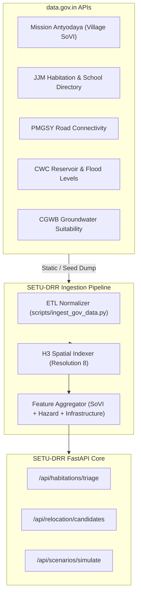

# SETU-DRR: data.gov.in API & Dataset Integration Guide

> ⚠️ **Verify against `DATA_GOV_IN_VERIFIED_FINDINGS.md` before using this document.**
> This file was written from catalog metadata only; it was not checked against the live API.
> Four of its claims do not hold — Mission Antyodaya does not cover either pilot district, and the
> schemas listed for CGWB groundwater (`2b787738`), groundwater contamination (`e6484423`) and
> district health centres (`39c05e0a`) do not match what those endpoints return.
> `DATA_GOV_IN_VERIFIED_FINDINGS.md` carries live-probed row counts, pilot coverage and the
> integration gotchas.


## 1. Overview & Catalog Summary
The government open data catalog contains **283,286 records** (267,510 unique datasets) across 464 sectors and ministries. 

To enable instant sub-millisecond querying without memory bottlenecks, the entire 467 MB catalog was parsed and indexed into a local SQLite database with **FTS5 BM25 Full-Text Search**:
* **Database Path**: `data/data_gov_apis.db` (Indexed in 5.9 seconds)
* **Total Indexed Datasets**: 267,510
* **Open REST APIs Ready**: 182,038 (68.0%)
* **Query Performance**: ~10–30ms per boolean/BM25 full-text query

---

## 2. CLI Tool Usage (`scripts/query_gov_apis.py`)

The project includes an interactive CLI tool for developers to explore, search, and inspect datasets.

### Basic Keyword Search
```bash
# Search for landslide or flood datasets with open API endpoints
python scripts/query_gov_apis.py search "landslide OR flood" --open-only --limit 10

# Search with sector filter
python scripts/query_gov_apis.py search "rainfall" --sector "Water Resources" --limit 5
```

### SETU-DRR Pillar Searches
The CLI contains pre-built boolean search queries mapped to each domain:
```bash
python scripts/query_gov_apis.py pillar hazards --open-only
python scripts/query_gov_apis.py pillar demographics --limit 15
python scripts/query_gov_apis.py pillar infrastructure --open-only
python scripts/query_gov_apis.py pillar relocation
python scripts/query_gov_apis.py pillar relief
```

### Dataset Inspection
To view all 14 metadata fields, schema column names, and the direct data.gov.in resource URL:
```bash
python scripts/query_gov_apis.py inspect <dataset_uuid>
```

---

## 3. High-Value Datasets Curated by Pillar

### Pillar 1: Hazards, Weather & Dam Safety

| Dataset UUID | Title | Ministry / Agency | Schema & Key Fields | Relevance to SETU-DRR |
| :--- | :--- | :--- | :--- | :--- |
| `6c05cd1b-ed59-40c2-bc31-e314f39c6971` | **Daily District-wise Rainfall Data** (Updated: Dec 2025) | Jal Shakti / NWIC | `State, District, Date, Year, Month, Avg_rainfall, Agency_name` | Dynamic rainfall monitoring and extreme event triggers. |
| `1fc2148c-fc41-46f5-a364-bdc03f77053f` | **Daily Reservoir Level Data (CWC)** (341 seasonal tables) | Central Water Commission (CWC) | `Reservoir_name, Basin, Subbasin, Lat, Long, Full_reservoir_level, Live_capacity_FRL, Storage` | Dam inundation risk, upstream storage threshold monitoring, and flood wave routing. |
| `c83bd2ff-49d8-4109-bbab-dd2af15949cd` | **State-wise CWC Flood Forecasting Stations** | Central Water Commission | `State/UT, Number of Flood Forecasting Stations - Level, Number of Inflow Stations` | Gauge station mapping to river reaches for flood alert modeling. |
| `16c52e9c-1284-4238-8d13-f22158d217b3` | **State/UT-wise Damages Caused by Floods** | CWC / Jal Shakti | `Year, State/UT, Area Affected, Population Affected, Crop Damage, Human Lives Lost, Houses Damaged` | Baseline historical hazard exposure calibration for risk score models. |
| `d86112bd-12ff-4761-b58f-ae672121536b` | **Accidental Deaths Due to Forces of Nature (2023)** | MHA / NCRB | `State/UT, Avalanche, Landslide, Flash Flood, Cold Wave, Heat Wave` | Calibrating casualty risk weights across hazard types. |
| `89e8a589-1089-4f2d-9ea5-a5fa66a8ac95` | **Reported Damages on National Highways (2024-25)** | Rajya Sabha / MoRTH | `State/UT, Length of Damaged NHs (in km) due to heavy rain, landslides, floods` | Lifeline vulnerability and critical transport corridor disruptions. |

---

### Pillar 2: Habitations, Village Census & SoVI Scoring

| Dataset UUID | Title | Ministry / Agency | Schema & Key Fields | Relevance to SETU-DRR |
| :--- | :--- | :--- | :--- | :--- |
| `37b67864-bcb4-4182-802c-f9d80ea326ab` *(Sikkim)*<br>`38212fb9-2bb7-47fc-a7a5-27bb07db360c` *(Ladakh)*<br>`dc53040e-6fa1-4a59-8a0d-67e77ce6f554` *(Kerala)* | **Mission Antyodaya Village Survey Data** (162 Indicators) | MoRD / Dept of Rural Development | `VILLAGE NAME, VILLAGE CODE, TOTAL POPULATION, MALE, FEMALE, TOTAL HOUSEHOLDS, KUCCHA WALL & ROOF HOUSEHOLDS, BPL RATION CARDS, ALL-WEATHER ROAD (Y/N), PHC/CHC, HANDICAPPED, ELDERLY PENSIONERS, COMMON PASTURES` | **The single most comprehensive village-level SoVI dataset in India.** Directly computes Social Vulnerability Index (SoVI), housing fragility, and elderly/youth dependence. |
| `6b8b6713-f747-463f-adca-6c551dbfeff5` *(Rudraprayag)*<br>`c613c68f-2643-443d-9159-7312a5a77505` *(Chamoli)*<br>`44d51efc-78d5-43c6-b62b-0123ad6dd1ba` *(Uttarkashi)* | **Primary Census Abstract (PCA) 2011 — Uttarakhand Districts** | Office of the Registrar General (ORGI) | `State, District, Sub-district, Village Code, Total Households, SC Population, ST Population, Literate, Main Workers, Agricultural Labourers` | Complete village-by-village baseline demographics for high-risk Himalayan districts. |
| `3f719ae6-c346-46f9-98ff-4add5bdc1881` | **Schools with Tap Connection under JJM** (Live: Sept 2026) | Jal Shakti / DDWS | `state_name, district_name, block_name, village_name, habitation_name, habitation_id, school_name, no_of_student, school_category` | Authoritative habitation names, official `habitation_id`, child vulnerability counts, and temporary evacuation center inventory. |
| `14e04b3a-20a7-4a23-a951-f89eedc1b17d` | **Habitations and SC/ST Composition** | Ministry of Education / NCERT | `State/UT, All Habitations Number, All Habitations Population, SC Population 50% or more, ST Population 50% or more` | Equity and vulnerability weighting in the triage algorithm. |

---

### Pillar 3: Lifeline & Critical Infrastructure

| Dataset UUID | Title | Ministry / Agency | Schema & Key Fields | Relevance to SETU-DRR |
| :--- | :--- | :--- | :--- | :--- |
| `d4361151-6d41-43c7-98cd-9a6cd90b5ca4` | **PMGSY Physical & Financial Progress** (Live: Sept 2026) | Ministry of Rural Development | `STATE_NAME, DISTRICT_NAME, PMGSY_SCHEME, NO_OF_ROAD_WORK_SANCTIONED, NO_OF_BRIDGES_SANCTIONED, NO_OF_ROAD_WORKS_COMPLETED, LENGTH_OF_ROAD_WORK_COMPLETED_KM, BALANCE_KM` | Evaluates road connectivity and post-disaster isolation risk for habitations lacking all-weather access. |
| `232c50b1-b245-4226-bd69-5e42c1fb7b71` *(HP)*<br>`39c05e0a-e428-46f3-aacd-0dbb1d51f65e` *(National)* | **District-wise Availability of Health Centres** | MoHFW / Statistics | `State, District, Sub-Centres, Primary Health Centres (PHC), Community Health Centres (CHC), District Hospitals, Beds Available` | Calculates travel time and distance to nearest emergency medical triage facility. |
| `e5163364-93bf-4083-9dc8-371ebe841087` | **Percentage of Habitations Connected under PMGSY** | MoRD | `State, Eligible Habitations, Connected Habitations, % of Habitations Connected` | State-level baseline of unconnected habitations requiring specialized evacuation planning. |

---

### Pillar 4: Candidate Relocation Site Suitability

| Dataset UUID | Title | Ministry / Agency | Schema & Key Fields | Relevance to SETU-DRR |
| :--- | :--- | :--- | :--- | :--- |
| `2b787738-ec56-4c2a-84cb-8d41ddd0e9bc` | **CGWB District Ground Water Level Monitoring** | Central Ground Water Board (CGWB) | `State, District, Well_No, Pre-monsoon water level (m), Post-monsoon water level (m), Net fluctuation` | Validates water table depth and perennial drinking water viability at candidate relocation sites. |
| `e6484423-9440-4b49-95a4-51c1d1a45a1c` | **Ground Water Contamination (Arsenic, Fluoride, Nitrate, Uranium)** | Jal Shakti / CGWB | `State/UT, District, Nitrate Occurrence, Fluoride Occurrence, Arsenic Occurrence, Uranium Occurrence` | Safety screening for relocation sites to avoid toxic aquifer zones. |
| `46b18992-22c6-4636-8c4d-9c7e40c5b95b` | **Annual Ground Water Recharge & Extraction (2020-2024)** | Jal Shakti Abhiyan | `State/UT, Annual Recharge, Annual Extraction, Stage of Extraction (Safe / Semi-Critical / Critical / Over-Exploited)` | Ensures candidate township sites are not placed in over-exploited groundwater blocks. |
| `a9a473d6-691b-4a25-a995-23098f2a7abf` | **State Land Use Pattern Datasets** | Dept of Agriculture / Economics | `Total Geographic Area, Forest Area, Land Not Available for Cultivation, Culturable Waste Land, Fallow Land` | Locating non-forest government / revenue wasteland parcels for relocation settlement. |

---

### Pillar 5: Disaster Relief & Capacities

| Dataset UUID | Title | Ministry / Agency | Schema & Key Fields | Relevance to SETU-DRR |
| :--- | :--- | :--- | :--- | :--- |
| `6054657b-2834-4ce9-ae48-3c73709110f7` | **SDRF and NDRF Funds Allocation & Releases (2023-24)** | Ministry of Home Affairs | `State, SDRF Allocation (Centre + State), NDRF Released` | Financial capacity planning and budget envelope estimation for relocation packages. |
| `6ee6994f-ff26-4ba5-8696-d91939f11e9a` | **Lives and Property Saved by NDRF (2018-2023)** | MHA / NDRF | `Year, Lives Rescued/Evacuated, Dead Bodies Retrieved, Relief Camps Managed` | Benchmark NDRF operational capacity metrics for scenario simulations. |
| `b38985cd-a488-476b-a625-fd963083a371` | **Crop Losses to Hydro-meteorological Disasters (2024-25)** | MoA&FW | `State/UT, Season, Area Affected (in Hectares), Disaster Type` | Economic livelihood impact modeling in habitations exposed to repetitive inundation. |

---

## 4. Integration Architecture Recommendations



### Key Engineering Recommendations:
1. **Never rely on real-time external API calls during live evaluations**:
   Government open data portals can experience latency spikes, rate limits, or SSL handshake timeouts. Seed data should be pre-ingested into SQLite/GeoJSON fixtures using the UUIDs identified above.
2. **Standardize on `VILLAGE_CODE` and `habitation_id`**:
   The `3f719ae6-c346-46f9-98ff-4add5bdc1881` dataset provides clean `habitation_id` mapping. Use this as the foreign key linking Census PCA demographics to Mission Antyodaya housing condition scores.
3. **Use Mission Antyodaya for Explainable AI (SHAP)**:
   The 162 variables in Mission Antyodaya (e.g., `NUMBER OF HOUSEHOLDS WITH KUCCHA WALL AND ROOF`, `WHETHER CONNECTED TO ALL WEATHER ROAD`, `AVAILABILITY OF SUB CENTRE PHC/CHC`) match the exact feature names displayed in the Right Panel SHAP waterfall chart.
